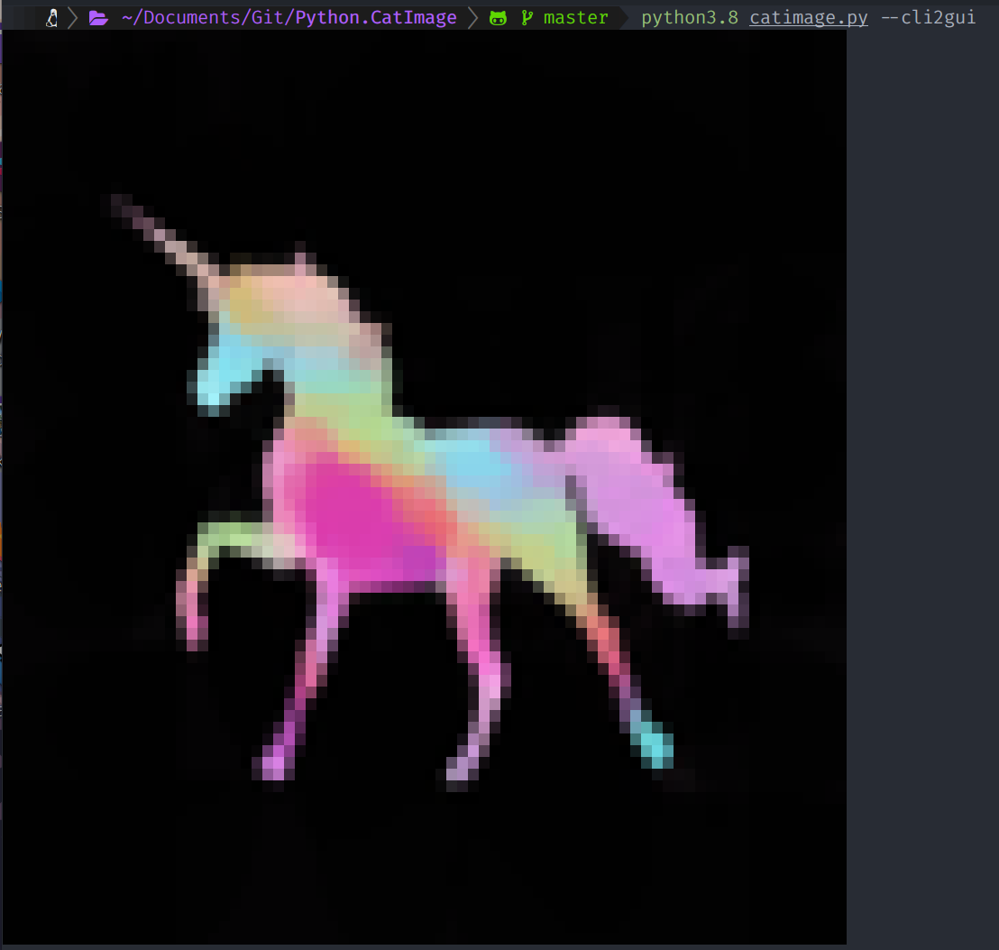

[](../../)
[](https://www.codacy.com/manual/FHPythonUtils/CatImage)
[](../../)
[](../../issues)
[](/LICENSE.md)
[](../../commits/master)
[](../../commits/master)
[](https://pypi.org/project/catimage/)
[](https://pypi.org/project/catimage/)

<!-- omit in toc -->
# CatImage


New Icon?


Cat an image to the terminal.

- [Install Single Script](#install-single-script)
	- [Wget](#wget)
	- [Curl](#curl)
- [Install With PIP](#install-with-pip)
- [Example](#example)
- [How To Use](#how-to-use)
- [Language information](#language-information)
	- [Built for](#built-for)
- [Install Python on Windows](#install-python-on-windows)
	- [Chocolatey](#chocolatey)
	- [Download](#download)
- [Install Python on Linux](#install-python-on-linux)
	- [Apt](#apt)
- [How to run](#how-to-run)
	- [With VSCode](#with-vscode)
	- [From the Terminal](#from-the-terminal)
- [How to update, build and publish](#how-to-update-build-and-publish)
- [Download](#download-1)
	- [Clone](#clone)
		- [Using The Command Line](#using-the-command-line)
		- [Using GitHub Desktop](#using-github-desktop)
	- [Download Zip File](#download-zip-file)
- [Community Files](#community-files)
	- [License](#license)
	- [Changelog](#changelog)
	- [Code of Conduct](#code-of-conduct)
	- [Contributing](#contributing)
	- [Security](#security)
- [Screenshots](#screenshots)
	- [Desktop](#desktop)

## Install Single Script
### Wget
```bash
wget -O /usr/bin/catimage https://raw.githubusercontent.com/FHPythonUtils/CatImage/master/catimage.py && sudo chmod 774 /usr/bin/catimage
```
### Curl
```bash
curl -o /usr/bin/catimage https://raw.githubusercontent.com/FHPythonUtils/CatImage/master/catimage.py && sudo chmod 774 /usr/bin/catimage
```

## Install With PIP

```python
pip install catimage
```

Head to https://pypi.org/project/catimage/ for more info


## Example
Original Image:


Greyscale Image:
```python
./catimage.py readme-assets/screenshots/desktop/example-0.png -g
```


Regular Definition Image:
```python
./catimage.py readme-assets/screenshots/desktop/example-0.png -r -t
```


Regular Definition Image with '@':
```python
./catimage.py readme-assets/screenshots/desktop/example-0.png -r -c @ -t
```


HD Image:
```python
./catimage.py readme-assets/screenshots/desktop/example-0.png -t
```


HD Image with right half block:
```python
./catimage.py readme-assets/screenshots/desktop/example-0.png -c $'\u2590' -t
```


HD Image True Colour:
```python
./catimage.py readme-assets/screenshots/desktop/example-0.png
```


## How To Use
Use to cat an image to the terminal, see the help text below for more
information on using this tool from the command line:
```bash
usage: catimage [-h] [-u] [-b] [-c CHAR] [-t] [-g | -r] image

cat an image to the terminal

positional arguments:
  image                 image file or url

optional arguments:
  -h, --help            show this help message and exit
  -u, --url             image is a URL
  -b, --big             big image
  -c CHAR, --char CHAR  char to use in colour print use $'chr' for escaped chars
  -t, --disable-truecolour
                        disable output in truecolour

choose one of the following:
  use the following arguments to change the look of the image

  -g, --greyscale       output image in greyscale (best for terminals that cannot handle ANSI)
  -r, --regular         output image in regular definition
```

GUI

Use the --cli2gui flag to launch a GUI

<div>


</div>

Alternatively, import into your project and use:

```python
def generateHDColour(imageName, maxLen, trueColour=True, char="\u2584"):
	"""Iterate through image pixels to make a printable string

	Args:
		imageName (str): path of the image on the filesystem (relative of
		absolute)
		maxLen (int): maximum of width and height in chars
		trueColour (bool, optional): print in true colour. Defaults to True.
		char (str, optional): use this char for each pixel. Defaults to "\u2584".

	Returns:
		str: string to print
	"""

def generateColour(imageName, maxLen, trueColour=True, char="\u2588"):
	"""Iterate through all of the pixels in an image and construct a printable
	string

	Args:
		imageName (str): path of the image on the filesystem (relative of
		absolute)
		maxLen (int): maximum of width and height in chars
		trueColour (bool, optional): print in true colour. Defaults to True.
		char (str, optional): use this char for each pixel. Defaults to "\u2588".

	Returns:
		str: string to print
	"""

def generateGreyscale(imageName, maxLen):
	"""Iterate through image pixels to make a printable string

	Args:
		imageName (str): path of the image on the filesystem (relative of
		absolute)
		maxLen (int): maximum of width and height in chars

	Returns:
		str: string to print
	"""
```

## Language information
### Built for
This program has been written for Python 3 and has been tested with
Python version 3.8.0 <https://www.python.org/downloads/release/python-380/>.

## Install Python on Windows
### Chocolatey
```powershell
choco install python
```
### Download
To install Python, go to <https://www.python.org/> and download the latest
version.

## Install Python on Linux
### Apt
```bash
sudo apt install python3.8
```

## How to run
### With VSCode
1. Open the .py file in vscode
2. Ensure a python 3.8 interpreter is selected (Ctrl+Shift+P > Python:Select Interpreter > Python 3.8)
3. Run by pressing Ctrl+F5 (if you are prompted to install any modules, accept)
### From the Terminal
```bash
./[file].py
```

## How to update, build and publish

1. Ensure you have installed the following dependencies
	Linux
	```bash
	wget dephell.org/install | python3.8
	wget https://raw.githubusercontent.com/python-poetry/poetry/master/get-poetry.py | python3.8
	```
	Windows
	```powershell
	(wget dephell.org/install -UseBasicParsing).Content | python
	(wget https://raw.githubusercontent.com/python-poetry/poetry/master/get-poetry.py -UseBasicParsing).Content | python
	```
2. Use poetry for the heavy lifting and dephell to generate requirements
	```bash
	poetry update
	dephell deps convert
	```
3. Build/ Publish
	```bash
	poetry build
	poetry publish
	```
	or
	```bash
	poetry publish --build
	```


## Download
### Clone
#### Using The Command Line
1. Press the Clone or download button in the top right
2. Copy the URL (link)
3. Open the command line and change directory to where you wish to
clone to
4. Type 'git clone' followed by URL in step 2
```bash
$ git clone https://github.com/FHPythonUtils/CatImage
```

More information can be found at
<https://help.github.com/en/articles/cloning-a-repository>

#### Using GitHub Desktop
1. Press the Clone or download button in the top right
2. Click open in desktop
3. Choose the path for where you want and click Clone

More information can be found at
<https://help.github.com/en/desktop/contributing-to-projects/cloning-a-repository-from-github-to-github-desktop>

### Download Zip File

1. Download this GitHub repository
2. Extract the zip archive
3. Copy/ move to the desired location


## Community Files
### License
MIT License
Copyright (c) FredHappyface
(See the [License](/LICENSE.md) for more information.)

### Changelog
See the [Changelog](/CHANGELOG.md) for more information.

### Code of Conduct
In the interest of fostering an open and welcoming environment, we
as contributors and maintainers pledge to make participation in our
project and our community a harassment-free experience for everyone.
Please see the
[Code of Conduct](https://github.com/FHPythonUtils/.github/blob/master/CODE_OF_CONDUCT.md) for more information.

### Contributing
Contributions are welcome, please see the [Contributing Guidelines](https://github.com/FHPythonUtils/.github/blob/master/CONTRIBUTING.md) for more information.

### Security
Thank you for improving the security of the project, please see the [Security Policy](https://github.com/FHPythonUtils/.github/blob/master/SECURITY.md) for more information.


## Screenshots

### Desktop
<div>


</div>
