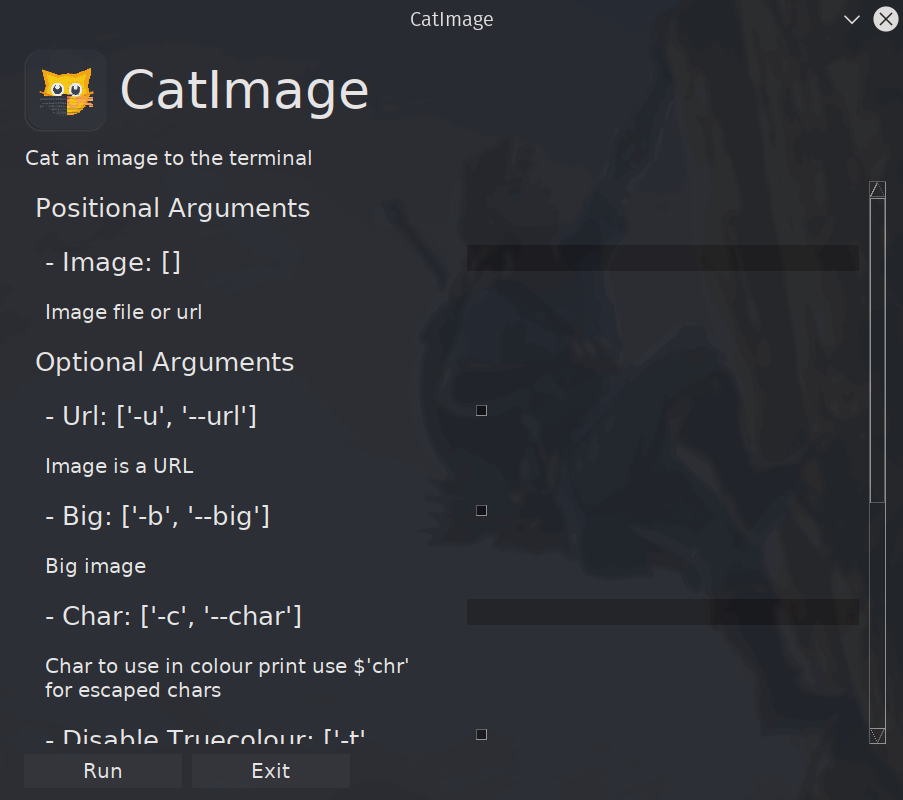

[](../../)
[](https://www.codacy.com/manual/FredHappyface/Python.CatImage)
[](../../)
[](../../issues)
[](/LICENSE.md)
[](../../commits/master)
[](../../commits/master)
[](https://pypi.org/project/catimage/)

# Python.CatImage


New Icon?


## Install Single Script
### Wget
```bash
wget -O /usr/bin/catimage https://raw.githubusercontent.com/FredHappyface/Python.CatImage/master/catimage.py && sudo chmod 774 /usr/bin/catimage
```
### Curl
```bash
curl -o /usr/bin/catimage https://raw.githubusercontent.com/FredHappyface/Python.CatImage/master/catimage.py && sudo chmod 774 /usr/bin/catimage
```

## Install With PIP

```python
pip install catimage
```

Head to https://pypi.org/project/catimage/ for more info


## Example
Original Image:


Greyscale Image:
```python
./catimage.py readme-assets/screenshots/desktop/example-0.png -g
```


Regular Definition Image:
```python
./catimage.py readme-assets/screenshots/desktop/example-0.png -r -t
```


Regular Definition Image with '@':
```python
./catimage.py readme-assets/screenshots/desktop/example-0.png -r -c @ -t
```


HD Image:
```python
./catimage.py readme-assets/screenshots/desktop/example-0.png -t
```


HD Image with right half block:
```python
./catimage.py readme-assets/screenshots/desktop/example-0.png -c $'\u2590' -t
```


HD Image True Colour:
```python
./catimage.py readme-assets/screenshots/desktop/example-0.png
```


## How To Use
Use to cat an image to the terminal, see the help text below for more
information on using this tool from the command line:
```python
usage: catimage.py [-h] [--gui] [-u] [-b] [-c Char] [-t] [-g | -r] Image

Cat an image to the terminal

positional arguments:
  Image                 Image file or url

optional arguments:
  -h, --help            show this help message and exit
  --gui                 Start program as a GUI. Note: Has a dumb terminal
  -u, --url             Image is a URL
  -b, --big             Big image
  -c Char, --char Char  Char to use in colour print use $'chr' for escaped chars
  -t, --disable-truecolour
                        Disable output in truecolour

Choose one of the following:
  Use the following arguments to change the look of the image

  -g, --greyscale       Output image in greyscale (best for terminals that cannot handle ANSI)
  -r, --regular         Output image in regular definition
```

GUI

Use the --cli2gui flag to launch a GUI

<div>


</div>

Alternatively, import into your project and use:

```python
def generateHDColour(imageName, maxLen, trueColour=True, char="\u2584"):
	"""Iterate through image pixels to make a printable string

	Args:
		imageName (str): path of the image on the filesystem (relative of
		absolute)
		maxLen (int): maximum of width and height in chars
		trueColour (bool, optional): print in true colour. Defaults to True.
		char (str, optional): use this char for each pixel. Defaults to "\u2584".

	Returns:
		str: string to print
	"""

def generateColour(imageName, maxLen, trueColour=True, char="\u2588"):
	"""Iterate through all of the pixels in an image and construct a printable
	string

	Args:
		imageName (str): path of the image on the filesystem (relative of
		absolute)
		maxLen (int): maximum of width and height in chars
		trueColour (bool, optional): print in true colour. Defaults to True.
		char (str, optional): use this char for each pixel. Defaults to "\u2588".

	Returns:
		str: string to print
	"""

def generateGreyscale(imageName, maxLen):
	"""Iterate through image pixels to make a printable string

	Args:
		imageName (str): path of the image on the filesystem (relative of
		absolute)
		maxLen (int): maximum of width and height in chars

	Returns:
		str: string to print
	"""
```

## Language information
### Built for
This program has been written for Python 3 and has been tested with
Python version 3.8.0 <https://www.python.org/downloads/release/python-380/>.

## Install Python on Windows
### Chocolatey
```powershell
choco install python
```
### Download
To install Python, go to <https://www.python.org/> and download the latest
version.

## Install Python on Linux
### Apt
```bash
sudo apt install python3.8
```

## How to run
### With VSCode
1. Open the .py file in vscode
2. Ensure a python 3.8 interpreter is selected (Ctrl+Shift+P > Python:Select Interpreter > Python 3.8)
3. Run by pressing Ctrl+F5 (if you are prompted to install any modules, accept)
### From the Terminal
```bash
./[file].py
```


## Changelog
See the [CHANGELOG](/CHANGELOG.md) for more information.


## Download
### Clone
#### Using The Command Line
1. Press the Clone or download button in the top right
2. Copy the URL (link)
3. Open the command line and change directory to where you wish to
clone to
4. Type 'git clone' followed by URL in step 2
```bash
$ git clone https://github.com/FredHappyface/Python.CatImage
```

More information can be found at
<https://help.github.com/en/articles/cloning-a-repository>

#### Using GitHub Desktop
1. Press the Clone or download button in the top right
2. Click open in desktop
3. Choose the path for where you want and click Clone

More information can be found at
<https://help.github.com/en/desktop/contributing-to-projects/cloning-a-repository-from-github-to-github-desktop>

### Download Zip File

1. Download this GitHub repository
2. Extract the zip archive
3. Copy/ move to the desired location


## Licence
MIT License
Copyright (c) FredHappyface
(See the [LICENSE](/LICENSE.md) for more information.)

## Screenshots

### Desktop
<div>


</div>
